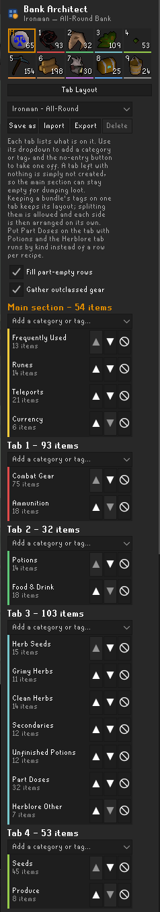
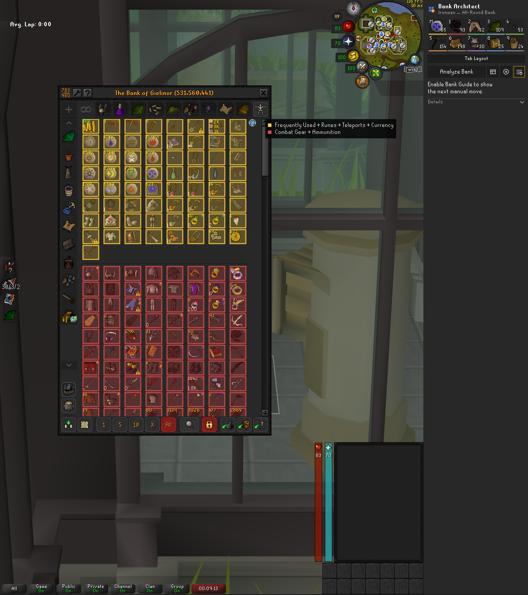
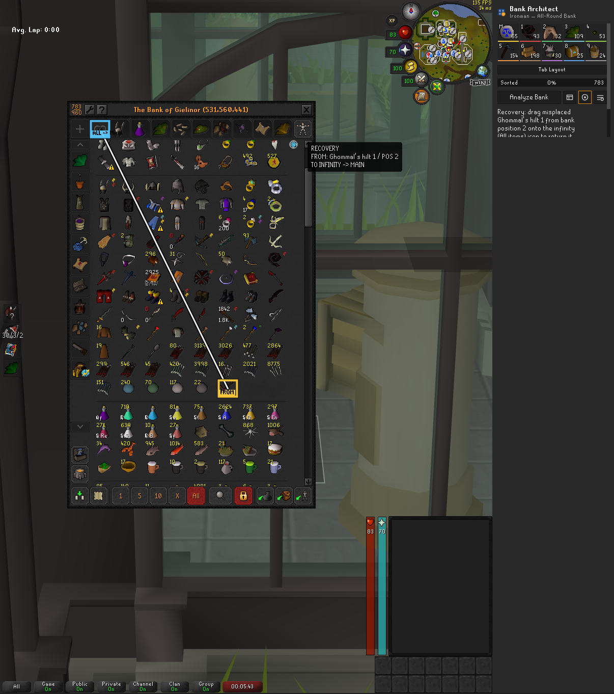

# Bank Architect

Bank Architect is a read-only RuneLite sidebar plugin for planning an organized
Ironman bank. It scans the bank you have open, creates a deterministic
blueprint for the items you own, and can highlight one safe manual move at a
time. You remain in control of every bank action.

The currently selectable workflow is **Ironman — All-Round Bank**, which sorts
owned items into ten purpose-driven destinations.

## Installation

After the plugin is published to the Plugin Hub:

1. Open RuneLite's configuration sidebar and select **Plugin Hub**.
2. Search for **Bank Architect** and choose **Install**.
3. Open the **Bank Architect** sidebar tab.

Bank Architect has no separate installer, account, or external service.

## Ironman — All-Round Bank workflow

1. **Scan:** open your bank and select **Analyze My Bank**. The plugin reads the
   open bank through supported RuneLite APIs.
2. **Review the blueprint:** select **Show My Bank** to inspect the proposed
   Main section and nine purpose-driven tabs. The blueprint preserves owned
   item IDs, quantities, and real placeholders; it does not invent missing
   items or blank slots. Your bank is also tinted in place: every item takes
   the colour of the tab it is planned for, with a legend beside the bank. That
   works in any bank view and needs nothing beyond the scan, so you can see the
   plan before deciding to act on it.
3. **Prepare the bank:** open the vanilla **All items** view and clear bank
   search and bank-tag filters. Either rearrange mode works; **Insert** mode
   usually needs fewer drags than **Swap** and the guide reports both counts.
4. **Follow manual guidance:** select **Show Bank Guide**. The overlay describes
   one supported manual tab or item move at a time. You perform every collapse,
   drag, swap, and drop yourself.
5. **Finish sorting:** the guide re-reads the bank after each manual action and
   advances only when the observed state is safe and consistent with the plan.

You can also copy the text blueprint for personal review without starting the
move guide.

## Correcting a classification

Classification fails closed, so an item the bundled data cannot place
confidently lands in **Storage & Cleanup** rather than being guessed into a tab
from a name resemblance. When that is wrong, or when you simply want an item
somewhere else, you can say so:

1. Select **Assign Categories** in the sidebar.
2. Right-click the item in your bank and choose **Bank Architect**, then the tag
   you want it on.
3. Select **Analyze My Bank** again to rebuild the blueprint.

The menu lists tags rather than the ten bundles, so you can be exact: you can say
an item is a *Secondary* rather than only that it is Herblore. The item then goes
wherever you have put that tag, so a correction and your tab layout can never
disagree.

Your correction wins over every automatic rule and is stored locally with the
plugin's settings, so it survives a client restart. Corrections you made before
the bundles were split still work. **Reset Corrections** clears
them all; choosing **Use automatic classification** clears a single item.
Corrections apply to the real item, so making one on a placeholder works too.

## Choosing your tab layout

The blueprint fills the bank's main section and nine tabs. You decide which
categories go where:

1. Select **Tab Layout** in the sidebar, under the destination icons.
2. The list is organised tab by tab: **Main section**, then **Tab 1** to
   **Tab 9**, each showing what is on it.
3. Every tab has a dropdown listing the categories and tags that are not on it
   yet, each with the tab it currently sits on. Pick one to move it here. The
   no-entry button beside a tag takes it off and sends it to the Storage &
   Cleanup tab.
4. Where a tab holds more than one tag, the arrows decide which comes first.
5. Every change is saved as you make it and the blueprint is rebuilt straight
   away. **Reset to default** puts the preset arrangement back.

The destination icons above the list carry their own numbers — **M** for the
main section, then **1** to **9** — and the count of what lands on each, so you
can see the shape of the bank while you build it.

### Saving and sharing a layout

The dropdown at the top of the editor holds your saved layouts. **Ironman -
All-Round** is the bundled one and always means the preset's own arrangement, so
there is always a way back to a working bank. As soon as you change something
the list shows **Custom (unsaved)**, because an edited layout is no longer the
one you loaded.

- **Save as** stores the current layout under a name.
- **Export** copies it to your clipboard as a share code you can paste anywhere.
- **Import** reads a code someone gave you. It is always saved under a free
  name, so importing never overwrites a layout you built.
- **Delete** forgets a saved layout. The bundled one cannot be deleted.

A share code looks like `BAv1~Maugor setup~frequently-used+runes|gear|...` — the
tag names stay readable on purpose, so a code that has lost something can be
spotted by eye rather than only failing mysteriously. Nothing is uploaded: the
code goes to your clipboard and you decide where it goes next.

### Categories and tags

The preset's ten categories are bundles. Each splits into tags you can place
separately, so runes need not follow teleports and food need not sit with
potions. Any number of tags may share a tab, and a tab left holding none is
simply not created — so you can keep the main section empty as a place to dump
loot and sort it later. Every tag always has a tab, so nothing falls out of the
blueprint.

Some bundles are laid out as a whole: the Herblore tags form recipe rows, the
resource tags follow their skill zones, and combat gear builds setup rows. Those
layouts survive as long as the tags stay on one tab. Split them across tabs and
each side is arranged on its own, which loses the rows rather than breaking
them — a trade you are free to make.

### Two settings in the layout editor

Both sit under the help text in **Tab Layout**, beside the tabs they affect.
They are also in the client's plugin settings under Bank Architect, since they
are stored there.

**Fill part-empty gear rows** and **Fill part-empty Herblore rows** decide what
happens when a group does not fill a row. A bank tab cannot hold an empty slot,
so an aligned row only keeps its shape if real items fill it.

They are asked separately because they are the same mechanism but not the same
trade. You may well want the four combat-style columns held straight while being
perfectly happy for a short recipe row to stop where it stops.

- **Gear on**: the grid holds its shape, at the cost of the odd unrelated item in
  a row. **Off**: the gear tab is laid out densely and nothing sits where it does
  not belong. Sets still hold together as columns, since that is a different
  rule. Turn it off if you have ever wondered why a pair of gloves is nowhere
  near the rest of its set.
- **Herblore on**: a part-finished recipe borrows from the rest of the tab so the
  next recipe still starts at the left edge. **Off**: a short row is left short
  and the recipes simply follow each other.

**Gather outclassed gear for alching** moves equipment you own two strictly
better versions of, and that is worth alching, to the Slayer & Boss Loot tab.
Turn it off to keep every piece of gear in the combat gear tab, for example when
you keep a spare set on purpose.

### Two ways to arrange Herblore

By default the Herblore tab is a **row per recipe**: grimy herb, clean herb,
seed, unfinished potion, secondary, then the 3, 2 and 1 dose.

Move **Part Doses** onto the tab that holds **Potions** and it changes to
**runs by kind** instead: all the grimy herbs, then all the clean ones, then the
unfinished potions, the secondaries and the seeds.

There is no switch for this, because moving that tag already says it. Recipe
rows only earn their space while the doses are on hand to finish the recipe;
once you keep your potions together elsewhere, the rows left behind would be
mostly gaps. Move the doses to any other tab and the recipe rows stay, since
that says something different.

Reordering only decides where a category goes. Which items land in it, the
corrections you have made, and the layout inside the tab are all unchanged, and
each destination keeps its colour so rearranging one tab does not recolour the
rest. Your layout is stored locally with the plugin's settings and survives a
client restart.

## Safety and privacy

Reviewing this for the Plugin Hub? [docs/for-reviewers.md](docs/for-reviewers.md)
points at the four files that touch live client state and answers the usual
questions about the bundled data, the menu entries, and threading.

Bank Architect is analysis and guidance software, not bank automation.

- It reads the open bank through supported RuneLite APIs and draws a sidebar,
  blueprint dialog, and input-transparent guide and destination-colour overlays.
- While **Assign Categories** is on it adds its own options to the bank
  right-click menu. Those options only record your choice in local settings;
  they perform no bank action.
- It never clicks, drags, types, sends packets, changes widgets, manipulates
  game state, or performs bank actions.
- It does not use reflection, native code, external processes, runtime network
  requests, analytics, telemetry, or external services.
- It does not read the player's inventory or equipped items.
- The player always performs and confirms every bank move manually.

The destination-colour overlay only draws, so it has no such gates and stays
available in any bank view. Only the move guide, which makes claims about what
is safe to drag next, fails closed.

Guidance fails closed when it cannot safely interpret the bank. In particular,
it pauses unless the bank is open in vanilla **All items** with search and
bank-tag filters cleared. It also pauses on unsupported tab states, unsafe
geometry, or a bank view that no longer matches the expected plan. Each advised
move is verified against the bank change you actually made — in Swap mode an
exchange, in Insert mode a single-item shift — and guidance pauses rather than
guessing when the observed change is something else.

The generated blueprint stays in the running client. Bank Architect does not
upload bank contents or send them to the OSRS Wiki or another service.

## Local data

Classification and sorting use curated datasets bundled inside the plugin jar.
Their sources, retrieval dates, revisions, and licences are pinned in the
repository. There are no runtime Wiki calls and no remotely updated rules.
Unknown or weakly supported classifications fail closed into the
**Storage & Cleanup** review tab instead of being confidently routed from a
name resemblance. Your own corrections are the way out of that tab and are the
only classification input that is not bundled with the plugin.

## Current limitations

- **Ironman — All-Round Bank** is the only selectable preset. Internal Main,
  PvM, PvP, and Skiller foundations are not available in the interface.
- Roadmap features that still require complete pinned data or a maintainer
  policy are not presented as shipped. This includes GE-value loot ordering
  and selectable additional presets.
- Storage & Cleanup is a deliberate review destination. It can contain an item
  the player chooses to keep; the plugin never drops or removes anything. Items
  that land there wrongly can be reassigned by hand.
- Manual guidance supports only the bank states and move types it can validate
  safely. It pauses rather than guessing.

## Screenshots

The layout editor, where you decide what goes on each tab. Every tab lists what
is on it and has a dropdown to add a category or tag; the arrows order a tab that
holds more than one, and the no-entry button takes one off:



Assign mode, which tints every bank item with the colour of the tab it is planned
for and names the tab in the legend. Right-clicking an item here offers the tags,
so you can correct one that landed wrong:



The generated blueprint, with the Main section and the tabs your layout produced:


The sorting phase inside a planned tab: green for slots already right, and one
highlighted MOVE/DROP pair at a time with the remaining insert count (in Swap
mode the same grid highlights a FROM/TO swap and an estimated count instead):


Recovery, for when an item ends up somewhere the blueprint did not plan. The
guide names the item and where to drag it back to rather than giving up:



## Support

Questions, bug reports, and suggestions go through
[GitHub Issues](https://github.com/PKoka5/bank-architect/issues).
Bank Architect is a third-party Plugin Hub plugin; RuneLite itself does not
provide support for it.

## Development

The project targets Java 11 and follows RuneLite's standard Plugin Hub project
layout.

Run the tests:

```powershell
.\gradlew.bat test
```

Start the local RuneLite development client:

```powershell
.\gradlew.bat run
```

The pinned data-source manifest is
[`item-sort-metadata-sources.tsv`](src/main/resources/com/pkoka5/ironmanbankarchitect/catalog/item-sort-metadata-sources.tsv).
