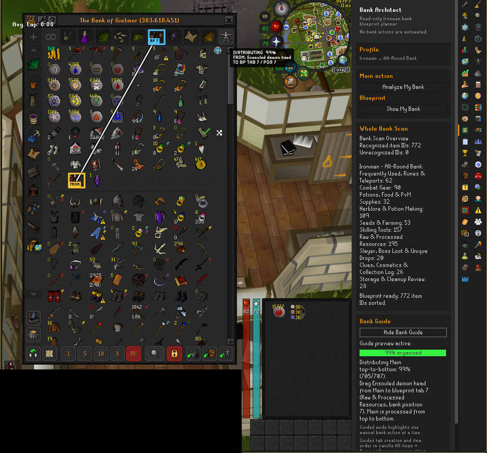
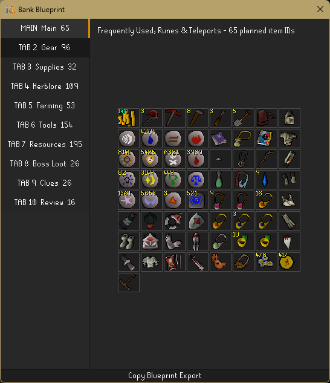
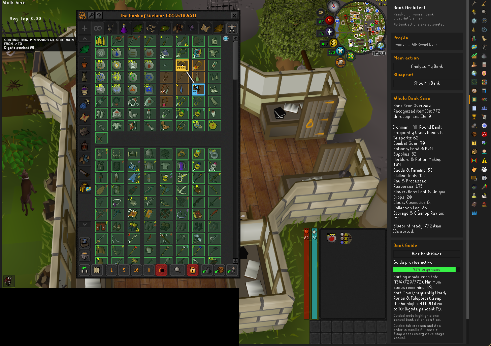

# Bank Architect

Bank Architect is a read-only RuneLite sidebar plugin for planning an organized
Ironman bank. It scans the bank you have open, creates a deterministic
blueprint for the items you own, and can highlight one safe manual move at a
time. You remain in control of every bank action.

The currently selectable workflow is **Ironman — All-Round Bank**, which sorts
owned items into ten purpose-driven destinations.

## Installation

After the plugin is published to the Plugin Hub:

1. Open RuneLite's configuration sidebar and select **Plugin Hub**.
2. Search for **Bank Architect** and choose **Install**.
3. Open the **Bank Architect** sidebar tab.

Bank Architect has no separate installer, account, or external service.

## Ironman — All-Round Bank workflow

1. **Scan:** open your bank and select **Analyze My Bank**. The plugin reads the
   open bank through supported RuneLite APIs.
2. **Review the blueprint:** select **Show My Bank** to inspect the proposed
   Main section and nine purpose-driven tabs. The blueprint preserves owned
   item IDs, quantities, and real placeholders; it does not invent missing
   items or blank slots.
3. **Prepare the bank:** open the vanilla **All items** view, select **Swap**
   mode, and clear bank search and bank-tag filters.
4. **Follow manual guidance:** select **Show Bank Guide**. The overlay describes
   one supported manual tab or item move at a time. You perform every collapse,
   drag, and swap yourself.
5. **Finish sorting:** the guide re-reads the bank after each manual action and
   advances only when the observed state is safe and consistent with the plan.

You can also copy the text blueprint for personal review without starting the
move guide.

## Safety and privacy

Bank Architect is analysis and guidance software, not bank automation.

- It reads the open bank through supported RuneLite APIs and draws a sidebar,
  blueprint dialog, and input-transparent guide overlay.
- It never clicks, drags, types, sends packets, changes widgets, manipulates
  game state, or performs bank actions.
- It does not use reflection, native code, external processes, runtime network
  requests, analytics, telemetry, or external services.
- It does not read the player's inventory or equipped items.
- The player always performs and confirms every bank move manually.

Guidance fails closed when it cannot safely interpret the bank. In particular,
it pauses unless the bank is open in vanilla **All items** and **Swap** mode
with search and bank-tag filters cleared. It also pauses on unsupported tab
states, unsafe geometry, or a bank view that no longer matches the expected
plan.

The generated blueprint stays in the running client. Bank Architect does not
upload bank contents or send them to the OSRS Wiki or another service.

## Local data

Classification and sorting use curated datasets bundled inside the plugin jar.
Their sources, retrieval dates, revisions, and licences are pinned in the
repository. There are no runtime Wiki calls and no remotely updated rules.
Unknown or weakly supported classifications fail closed into the
**Storage & Cleanup** review tab instead of being confidently routed from a
name resemblance.

## Current limitations

- **Ironman — All-Round Bank** is the only selectable preset. Internal Main,
  PvM, PvP, and Skiller foundations are not available in the interface.
- Roadmap features that still require complete pinned data or a maintainer
  policy are not presented as shipped. This includes GE-value loot ordering
  and selectable additional presets.
- Storage & Cleanup is a deliberate review destination. It can contain an item
  the player chooses to keep; the plugin never drops or removes anything.
- Manual guidance supports only the bank states and move types it can validate
  safely. It pauses rather than guessing.

## Screenshots

The sidebar with a completed whole-bank scan while the guide walks the
distribution phase — one highlighted manual drag at a time:



The generated blueprint with the Main section and nine purpose-driven tabs:



The sorting phase inside a planned tab, showing the validation grid, the
highlighted FROM/TO swap, and the exact minimum number of swaps remaining:



## Development

The project targets Java 11 and follows RuneLite's standard Plugin Hub project
layout.

Run the tests:

```powershell
.\gradlew.bat test
```

Start the local RuneLite development client:

```powershell
.\gradlew.bat run
```

The pinned data-source manifest is
[`item-sort-metadata-sources.tsv`](src/main/resources/com/pkoka5/ironmanbankarchitect/catalog/item-sort-metadata-sources.tsv).
