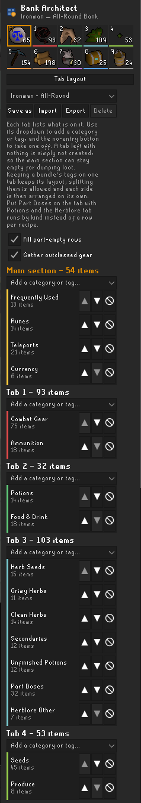
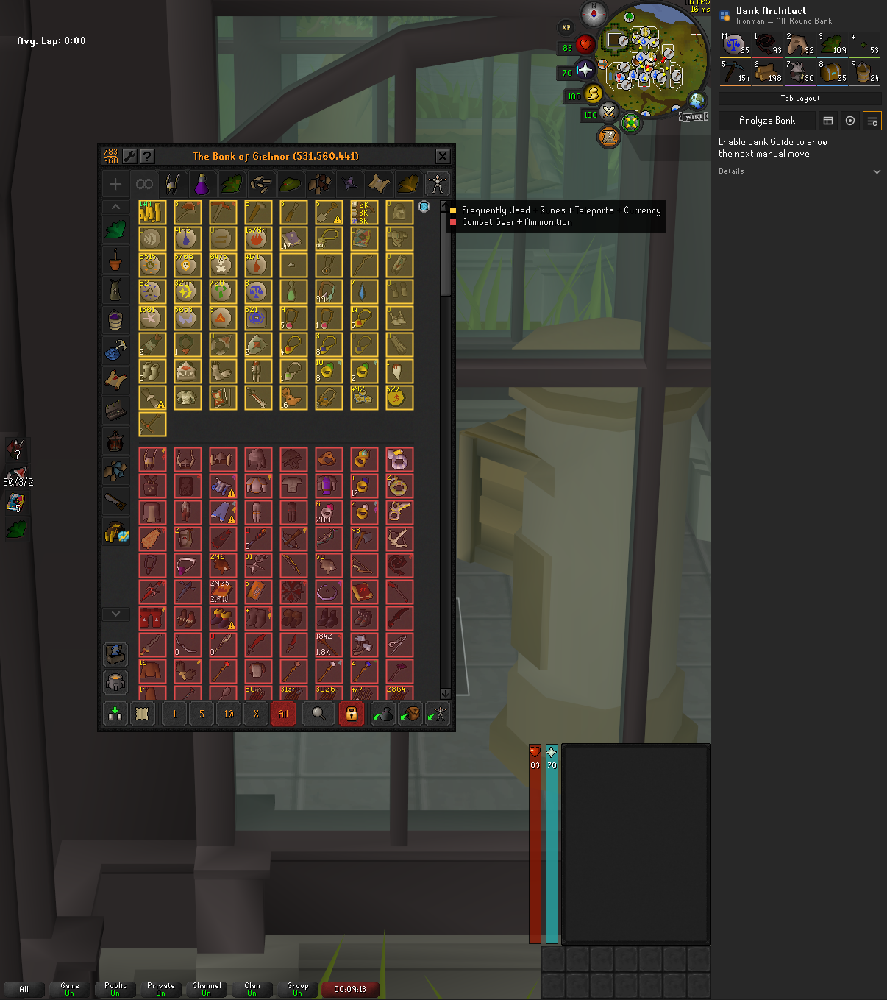
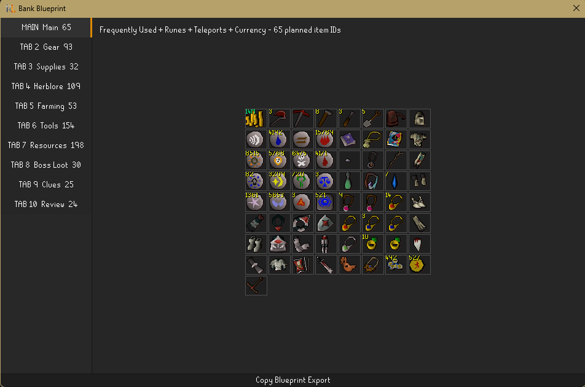
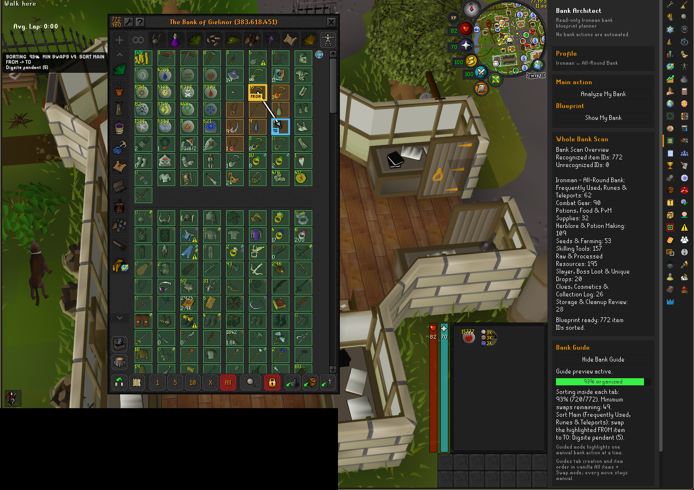
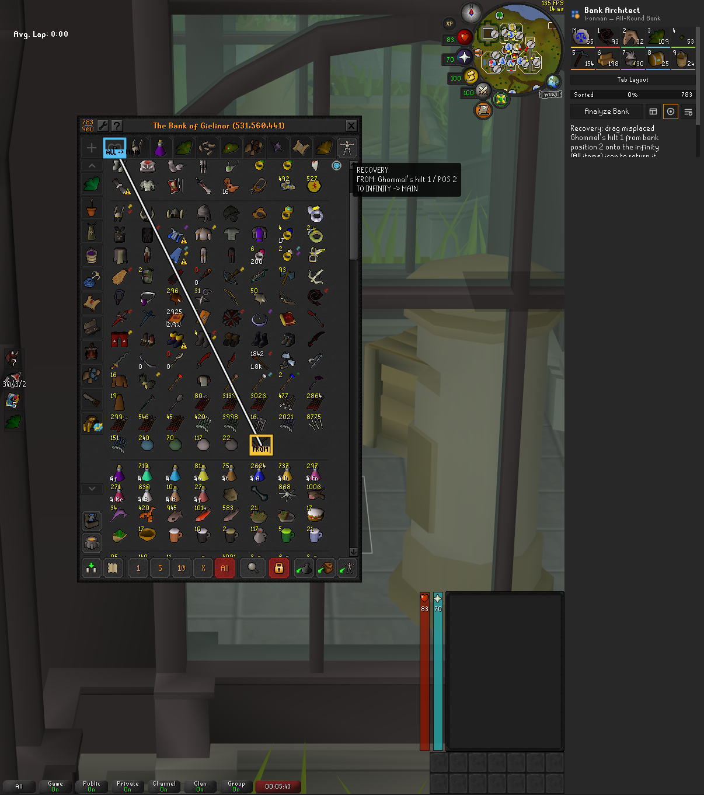

# Bank Architect

Bank Architect is a read-only RuneLite sidebar plugin for planning an organized
Main or Ironman bank. It scans the bank you have open, creates a deterministic
blueprint for the items you own, and can highlight one safe manual move at a
time. You remain in control of every bank action.

Choose **Ironman — All-Round Bank**, **Main — All-Round Bank**, or your saved
custom preset from the single chooser at the top of the sidebar. Both bundled
presets sort owned items into ten purpose-driven destinations. Editing a bundled
layout creates a custom preset, preserving the original defaults.

Main groups runes and teleports in one tab, all combat styles together, potions
in 4–3–2–1 dose order, and herbs, seeds and unfinished potions by stage. Ironman
retains its original recipe-oriented arrangement. Both use the same reviewed
Alch rules: replaced gear and tools can move to Alch, while best-owned tools,
staff rune supply and your personal corrections remain protected.

Taking out gear while leaving its placeholders preserves established Gear/Alch
placement during the same RuneLite session, including when new items are deposited.
Reviewed armour can also use a higher-tier placeholder of the same combat style
and equipment slot after restarting. Other replacement rules require real bank
items; changed existing facts or preferences trigger reassessment. Use a saved
current-bank blueprint to preserve your chosen arrangement across restarts.

## Installation

Install from the RuneLite Plugin Hub:

1. Open RuneLite's configuration sidebar and select **Plugin Hub**.
2. Search for **Bank Architect** and choose **Install**.
3. Open the **Bank Architect** sidebar tab.

Bank Architect has no separate installer, account, or external service.

## Ironman — All-Round Bank workflow

1. **Scan:** open your bank and select **Analyze Bank**. The plugin reads the
   open bank through supported RuneLite APIs.
2. **Review the blueprint:** select **Open Blueprint** to inspect the proposed
   Main section and nine purpose-driven tabs. The blueprint preserves owned
   item IDs, quantities, and real placeholders; it does not invent missing
   items or blank slots. Your bank is also tinted in place: every item takes
   the colour of the tab it is planned for, with a legend beside the bank. That
   works in any bank view and needs nothing beyond the scan, so you can see the
   plan before deciding to act on it.
3. **Prepare the bank:** open the vanilla **All items** view and clear bank
   search and bank-tag filters. Either rearrange mode works; **Insert** mode
   usually needs fewer drags than **Swap** and the guide reports both counts.
4. **Follow manual guidance:** select **Sorting Guide**. The overlay describes
   one supported manual tab or item move at a time. Where suitable, it suggests
   moving neighboring tabs as a whole to preserve their contents. You perform
   every collapse, drag, swap, and drop yourself.
5. **Finish sorting:** the guide re-reads the bank after each manual action and
   advances only when the observed state is safe and consistent with the plan.

You can also copy the text blueprint for personal review without starting the
move guide.

## Correcting a classification

Classification fails closed, so an item the bundled data cannot place
confidently lands in **Storage & Cleanup** rather than being guessed into a tab
from a name resemblance. When that is wrong, or when you simply want an item
somewhere else, you can say so:

1. Select **Assign Categories** in the sidebar.
2. Right-click the item in your bank and choose **Bank Architect**, then the tag
   you want it on.
3. Select **Analyze Bank** again to rebuild the blueprint.

The menu lists tags rather than the ten bundles, so you can be exact: you can say
an item is a *Secondary* rather than only that it is Herblore. The item then goes
wherever you have put that tag, so a correction and your tab layout can never
disagree.

Your correction wins over every automatic rule and is stored locally with the
plugin's settings, so it survives a client restart. Corrections you made before
the bundles were split still work. **Reset Corrections** clears
them all; choosing **Use automatic classification** clears a single item.
Corrections apply to the real item, so making one on a placeholder works too.

The blueprint tooltip shows the chosen placement and independently reviewed
usage roles where available. Clue, quest and alternative-storage hints explain
what to check before removing an item; Storage & Cleanup is a review destination,
not a claim that an item is safe to discard. Items with known additional uses
stay out of the automatic outclassed-gear selection. Your own assignments still win.

In the main tab, assigning an
item to Frequently Used also changes its sorting role, even when its original
classification is Currency. A tag selects a group; it does not fix an exact slot.

## Editing individual blueprint items

After an update, the first sidebar opening shows **What's new**. Select
**Got it - continue** to return to the normal plugin. This is remembered locally
for that release; release notes are bundled with the plugin and require no network request.

Open **Open Blueprint**, select a tab, then **Edit this tab**. Click an item to select
it with a green border, choose **Swap** or **Insert**, then click the target slot.
Swap exchanges the two items. Insert puts the selected item at the clicked slot
and shifts the items between them. Click the selected item again to deselect it.
For example, place coins first and platinum tokens second. To move one item between tabs, drag it onto
the destination tab's header, then select its position there. If that tab holds
multiple tags, choose the destination tag; an empty tab needs a tag assigned in Layout first.

**Undo** reverses a draft move, **Cancel** discards the draft, and **Save** stores
all changes together for the active profile. Export and guidance use the saved
blueprint. A changed bank or profile requires reopening Edit before saving.
You still move every real bank item manually.

Manual item order takes priority over automatic shapes and block arrangements.
Absent items keep their saved relative positions for when they return; new items
append. **Reset tab order** restores automatic ordering and releases individual
items moved into that tab. It preserves category corrections made through the bank
menu. A saved cross-tab destination becomes inactive if you change that item's
category correction or move its destination tag to another tab.

## Choosing your tab layout

### Keep your own order in a tab

Open **Open Blueprint**, select a tab, and enable **Keep current order**. The
guide still helps move items into and out of that tab, but accepts your current
item order instead of asking you to rearrange it. Normal moves to the tab header
append incoming items. Other tabs continue to follow their blueprint order.

The blueprint grid shows the saved or automatic arrangement; the selected tab's
status explains when guidance follows your actual bank order. Disabling the
option restores that arrangement without deleting saved item positions or
cross-tab assignments. The option also works for Main and empty destinations.

Changes are saved locally. Use **Tab Layout > Save as** to include the choices
in a named layout; switching layouts restores that layout's choices. Layout
share codes include these choices, but never individual saved item positions.

### Use your current bank as the blueprint

After manually adjusting your bank, keep it open and select **Open Blueprint**,
then **Save current bank...**. Enter a name. The plugin saves Main, all numbered
tabs and their current item order as a new active layout, preserving your previous
layout. Existing names get a numbered suffix.

Analyze again or reopen the bank: these saved positions remain the target, including
mixed-category tabs and placeholders. Missing items keep their saved positions for
when they return; new items follow their automatic category placement and append.
Category changes do not undo captured positions. **Assign category...** in the item
editor can move an individual item again, and **Reset tab order** releases the saved
positions in that tab. Use the header preset chooser to switch back to your previous layout.

Remove bank fillers before saving. If bank contents, the active layout or the
analysis changes while saving, nothing is overwritten; analyze and try again.
Captured item positions are local to your saved layout; layout share codes still
share category assignments rather than individual item positions.

### Arrange categories

The blueprint fills the bank's main section and nine tabs. You decide which
categories go where:

1. Select **Tab Layout** in the sidebar, under the destination icons.
2. The list is organised tab by tab: **Main section**, then **Tab 1** to
   **Tab 9**, each showing what is on it.
3. Every tab has a dropdown listing the categories and tags that are not on it
   yet, each with the tab it currently sits on. Pick one to move it here. The
   no-entry button beside a tag takes it off and sends it to the Storage &
   Cleanup tab.
4. Where a tab holds more than one tag, the arrows decide which comes first.
5. Every change is saved as you make it and the blueprint is rebuilt straight
   away. **Reset to default** puts the preset arrangement back.

The destination icons above the list carry their own numbers — **M** for the
main section, then **1** to **9** — and the count of what lands on each, so you
can see the shape of the bank while you build it.

### Saving and sharing a layout

The header preset chooser lets you keep several versions of your bank.
The bundled **Ironman** and **Main** presets always stay available. Editing a
bundled layout creates a **Custom layout**; selecting a bundled preset restores
its defaults. Saved customs keep their own layout preferences and corrections.

- **Save as** stores the current layout under a name.
- **Export** copies it to your clipboard as a share code you can paste anywhere.
- **Import** reads a code someone gave you. It is always saved under a free
  name, so importing never overwrites a layout you built.
- **Delete** forgets a saved layout. The bundled one cannot be deleted.

A share code looks like `BAv1~Maugor setup~frequently-used+runes|gear|...` — the
tag names stay readable on purpose, so a code that has lost something can be
spotted by eye rather than only failing mysteriously. Nothing is uploaded: the
code goes to your clipboard and you decide where it goes next.

### Categories and tags

The preset's ten categories are bundles. Each splits into tags you can place
separately, so runes need not follow teleports and food need not sit with
potions. Any number of tags may share a tab, and a tab left holding none is
simply not created — so you can keep the main section empty as a place to dump
loot and sort it later. Every tag always has a tab, so nothing falls out of the
blueprint.

Some bundles are laid out as a whole: the Herblore tags form recipe rows, the
resource tags follow their skill zones, and combat gear builds setup rows. Those
layouts survive as long as the tags stay on one tab. Split them across tabs and
each side is arranged on its own, which loses the rows rather than breaking
them — a trade you are free to make.

### Two settings in the layout editor

Both sit under the help text in **Tab Layout**, beside the tabs they affect.
They are also in the client's plugin settings under Bank Architect, since they
are stored there.

**Fill part-empty gear rows** and **Fill part-empty Herblore rows** decide what
happens when a group does not fill a row. A bank tab cannot hold an empty slot,
so an aligned row only keeps its shape if real items fill it.

They are asked separately because they are the same mechanism but not the same
trade. You may well want the four combat-style columns held straight while being
perfectly happy for a short recipe row to stop where it stops.

- **Gear on**: the best owned gear uses vertical combat-style columns. Other sets
  use vertical columns in the same grid, with real loose gear filling the space
  around them. Very small banks stay compact when a column cannot physically fit.
  **Off**: sets use columns without reserving best-gear
  equipment rows. List and grid layouts share the same reviewed set families.
- **Herblore on**: a part-finished recipe borrows from the rest of the tab so the
  next recipe still starts at the left edge. **Off**: a short row is left short
  and the recipes simply follow each other.

The default Combat front gives general Strength gear and raid weapons a reviewed
navigation priority. Torva leads the melee armour column when present; Oathplate,
Inquisitor and tank sets remain together vertically. Slash, stab, crush and
special-attack weapons form separate groups outside existing armour sets.
When Bowfa leads the ranged column, owned Crystal armour accompanies it.
Shared pieces occupy one physical slot. These are bank placement choices;
content-specific setups still matter, and personal blueprint choices take priority.

**Gather outclassed gear** sends reviewed replaced gear and tools to the
separately placeable **Alch** tag. Main and Ironman use the same rules. The best
owned reviewed gear stays; Rune and Adamant axes move when you own a better axe,
elemental staffs preserve rune supply, and equivalent ordinary Mystic colours
keep one stable variant. Dragon halberds count as Alch stock by default.
Unreviewed duplicates need conservative stat/value evidence. Personal item
choices always win. Turn gathering off to retain the normal categories.

Main and Ironman place finished arrows, bolts (including Bolt rack), darts and
cannonballs in **Slayer & Boss Loot** by default, including placeholders.
They form separate groups in that order, using the existing ammunition tiers;
Alch items stay together afterward. Components and the Bolt pouch keep their
existing roles. Assign an item to **Combat Gear** or
**Ammunition** to keep it in Combat. Existing captured banks, valid saved editor
destinations and relocated Ammunition groups retain the player's choice.

### Two ways to arrange Herblore

Ironman's default Herblore tab is a **row per recipe**: grimy herb, clean herb,
seed, unfinished potion, secondary, then the 3, 2 and 1 dose.
Main starts with dense runs by kind and keeps finished potion families in 4–3–2–1
dose order with Food & Potions.

Move **Part Doses** onto the tab that holds **Potions** and it changes to
**runs by kind** instead: all the grimy herbs, then all the clean ones, then the
unfinished potions, the secondaries and the seeds.

There is no switch for this, because moving that tag already says it. Recipe
rows only earn their space while the doses are on hand to finish the recipe;
once you keep your potions together elsewhere, the rows left behind would be
mostly gaps. Move the doses to any other tab and the recipe rows stay, since
that says something different.

Reordering only decides where a category goes. Which items land in it, the
corrections you have made, and the layout inside the tab are all unchanged, and
each destination keeps its colour so rearranging one tab does not recolour the
rest. Your layout is stored locally with the plugin's settings and survives a
client restart.

## Safety and privacy

Reviewing this for the Plugin Hub? [docs/for-reviewers.md](docs/for-reviewers.md)
points at the four files that touch live client state and answers the usual
questions about the bundled data, the menu entries, and threading.

Bank Architect is analysis and guidance software, not bank automation.

- It reads the open bank through supported RuneLite APIs and draws a sidebar,
  blueprint dialog, and input-transparent guide and destination-colour overlays.
- While **Assign Categories** is on it adds its own options to the bank
  right-click menu. Those options only record your choice in local settings;
  they perform no bank action.
- It never clicks, drags, types, sends packets, changes widgets, manipulates
  game state, or performs bank actions.
- It does not use reflection, native code, external processes, runtime network
  requests, analytics, telemetry, or external services.
- It does not read the player's inventory or equipped items.
- The player always performs and confirms every bank move manually.

The destination-colour overlay only draws, so it has no such gates and stays
available in any bank view. Only the move guide, which makes claims about what
is safe to drag next, fails closed.

Guidance fails closed when it cannot safely interpret the bank. In particular,
it pauses unless the bank is open in vanilla **All items** with search and
bank-tag filters cleared. It also pauses on unsupported tab states, unsafe
geometry, or a bank view that no longer matches the expected plan. Each advised
move is verified against the bank change you actually made — in Swap mode an
exchange, in Insert mode a single-item shift — and guidance pauses rather than
guessing when the observed change is something else.

The generated blueprint stays in the running client. Bank Architect does not
upload bank contents or send them to the OSRS Wiki or another service.

## Local data

Classification and sorting use curated datasets bundled inside the plugin jar.
Their sources, retrieval dates, revisions, and licences are pinned in the
repository. There are no runtime Wiki calls and no remotely updated rules.
Unknown or weakly supported classifications fail closed into the
**Storage & Cleanup** review tab instead of being confidently routed from a
name resemblance. Your own corrections are the way out of that tab and are the
only classification input that is not bundled with the plugin.

## Current limitations

- **Ironman**, **Main** and saved custom presets are selectable. Internal
  PvM, PvP and Skiller foundations are not available in the interface.
- Roadmap features that still require complete pinned data or a maintainer
  policy are not presented as shipped. This includes GE-value loot ordering
  and selectable additional presets.
- Storage & Cleanup is a deliberate review destination. It can contain an item
  the player chooses to keep; the plugin never drops or removes anything. Items
  that land there wrongly can be reassigned by hand.
- Manual guidance supports only the bank states and move types it can validate
  safely. It pauses rather than guessing.

## Screenshots

The layout editor, where you decide what goes on each tab. Every tab lists what
is on it and has a dropdown to add a category or tag; the arrows order a tab that
holds more than one, and the no-entry button takes one off:



Assign mode, which tints every bank item with the colour of the tab it is planned
for and names the tab in the legend. Right-clicking an item here offers the tags,
so you can correct one that landed wrong:



The generated blueprint, with the Main section and the tabs your layout produced:



The sorting phase inside a planned tab: green for slots already right, and one
highlighted MOVE/DROP pair at a time with the remaining insert count (in Swap
mode the same grid highlights a FROM/TO swap and an estimated count instead):



Recovery, for when an item ends up somewhere the blueprint did not plan. The
guide names the item and where to drag it back to rather than giving up:



## Support

Questions, bug reports, and suggestions go through
[GitHub Issues](https://github.com/PKoka5/bank-architect/issues).
Bank Architect is a third-party Plugin Hub plugin; RuneLite itself does not
provide support for it.

## Development

The project targets Java 11 and follows RuneLite's standard Plugin Hub project
layout.

Run the tests:

```powershell
.\gradlew.bat test
```

Run the full regression gate before releasing:

```powershell
.\gradlew.bat check
```

`check` (and therefore `build`) runs the tests and `verifySimulationBaselines`.
The latter regenerates the fixed-seed simulation reports and checks all four
reviewed SHA-256 fingerprints. Only line endings are canonicalized to the CRLF
reference, so the check also works with LF checkouts. A mismatch fails the build;
inspect the behavior change rather than automatically replacing the hashes.
Run simulations with custom `-Psim...` parameters separately from this gate.

The potion, farming, gear, tool/outfit, and resource layout families are ordered TSV resources under
`src/main/resources/com/pkoka5/ironmanbankarchitect/catalog/`. Their row and
member order is part of the shipped layout. Extraction regression tests also
check fingerprints of the original Java tables, independently of simulations.
Barrows rows preserve equipment-part and degradation-state order. Tool and resource
groups deliberately allow overlap across rows, while duplicate IDs within a row
are rejected. Layout geometry remains in Java.

Required catalog and item-set resources load on first use and retain a clear
analysis failure if missing or invalid, instead of poisoning static initialization.
Empty tables and malformed or duplicate records are rejected; parser tests cover
these failure paths. All data stays bundled locally; no runtime downloads occur.

Start the local RuneLite development client:

```powershell
.\gradlew.bat run
```

The pinned data-source manifest is
[`item-sort-metadata-sources.tsv`](src/main/resources/com/pkoka5/ironmanbankarchitect/catalog/item-sort-metadata-sources.tsv).
